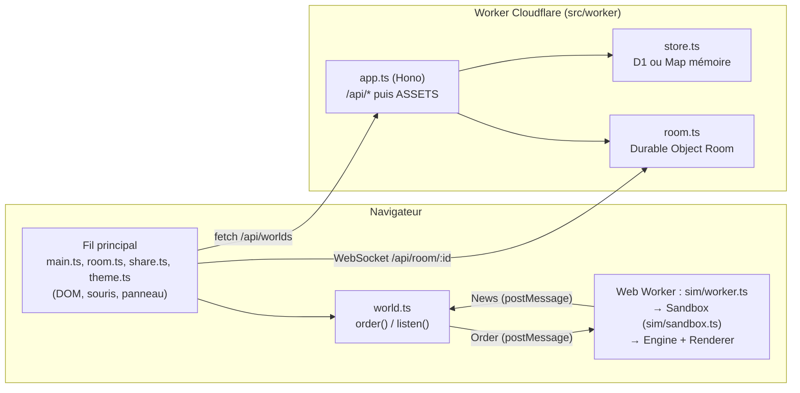

# Architecture

Vue d'ensemble pour un agent qui arrive sur le projet. Le détail des règles de
la simulation est dans [simulation.md](simulation.md).

## Trois fils d'exécution



1. **Le fil principal** (page) ne simule rien. Il gère le DOM, traduit la souris
   en `Gesture`, envoie des **ordres** au bac et pose les pixels qu'il reçoit
   (`present()`, un `putImageData` par rafraîchissement d'écran).
2. **Le Web Worker de simulation** ([sim/worker.ts](../../src/client/sim/worker.ts))
   héberge `Sandbox`, qui possède l'`Engine` et le `Renderer`. Il avance au
   temps réellement écoulé (`setTimeout` à ~60 Hz, pas de `requestAnimationFrame`)
   et renvoie des **nouvelles**. L'échéance suivante est posée dans un
   `finally` : une exception du moteur ne coupe plus la boucle pour de bon.
3. **Le Worker Cloudflare** sert le site statique **et** l'API — il n'y a pas
   de projet Pages séparé.

Conséquence clé : **aucun module de la page n'importe l'`Engine`**. Tout ce
qui a besoin de la grille passe par [world.ts](../../src/client/world.ts).

## Le protocole page ↔ bac

Défini dans [sim/sandbox.ts](../../src/client/sim/sandbox.ts) (`Order`, `News`).

| Ordre (`order()`) | Effet côté bac |
| --- | --- |
| `do` `{g}` | Applique un `Gesture` (ignoré pendant un rejeu). **N'envoyer que via `gesture()` de main.ts.** |
| `set` `{k}` | Met à jour les réglages (`Knobs` : vent, ambiante, gravité, vitesse, pause, vue thermique, salon…) |
| `size` `{w,h,keep}` | Recrée moteur et rendu ; vide l'annulation, abandonne l'enregistrement, arrête le rejeu, désarme le défi |
| `load` `{data,ask?,quiet?}` | Pose une grille encodée ; `quiet` = sans cran d'annulation (salon). Arrête le rejeu et désarme le défi en cours — un monde-défi réarme le sien par `goal` juste après |
| `edit` | `clear` / `undo` / `redo` / `step` / `snapshot`. Pendant un rejeu, `step` l'avance d'un tick, `clear` / `undo` / `redo` l'arrêtent d'abord. `clear` désarme le défi |
| `scene` `{name}` | Bâtit un défi ou un décor de `challenges.ts` ; arrête le rejeu |
| `goal` `{goal}` | Objectif d'un monde-défi (`ge:12:600`) |
| `cursor` `{x,y}` | Position de la sonde |
| `clip` `{ask,…}` | Découpe un rectangle, répond par `reply` |
| `rec` / `play` `{on}` | Enregistrement / rejeu. Le rejeu obéit à la pause ; à sa fin, le moteur reprend les réglages du panneau (`knobs`) |

| Nouvelle (`listen()`) | Fréquence | Contenu |
| --- | --- | --- |
| `frame` | chaque frame | pixels RGBA, taille, sonde `[matière, °C]` |
| `stats` | 2 × / s | nombre de cellules pleines |
| `grid` | 4 × / s | grille encodée complète (`full`) + version courte pour le salon (`room`) |
| `reply` | à la demande | réponse numérotée à `askLoad()` / `askClip()` |
| `say` | à la demande | message pour la barre de statut |
| `won` | à la demande | le défi en cours est réussi (vérifié toutes les 500 ms dans le Worker) |
| `rec` / `play` | à la demande | fin d'enregistrement, début/fin de rejeu |

Questions-réponses : `askLoad()` et `askClip()` numérotent leur ordre (`ask`) et
attendent la `reply` qui porte le même numéro. C'est le seul moyen d'`await`
quelque chose du bac depuis la page.

`latestGrid()` rend la dernière nouvelle `grid` reçue : sauvegarder ou ranger
le bac en `localStorage` n'attend donc jamais le Worker (important quand
l'onglet part en arrière-plan).

## Le chemin d'un coup de pinceau

```
souris (main.ts)
  → gesture(g)                    ← passage unique, ne pas contourner
      ├─ order({t:"do", g})       → Sandbox.order → applyGesture(engine, g) → rec?.gesture(g)
      └─ relay(g)                 → WebSocket → hôte du salon (si on est invité)
```

Poster `order({t:"do"})` ailleurs que dans `gesture()` : le geste n'atteint pas
l'hôte d'un salon et un invité le voit effacé par l'instantané suivant.

Une créature de taille fixe (le lapin) passe par le même `paint`, mais
`placesCreature()` de main.ts n'en envoie qu'un par clic (ni trait ni dépôt
continu), et `paint()` côté moteur en pose une entière quel que soit le rayon
reçu : un pair de salon ne peut pas en semer un disque.

## Salon partagé (bac multijoueur)

- Serveur : [src/worker/room.ts](../../src/worker/room.ts), un Durable Object par
  nom de salon, API d'hibernation des WebSockets. **Il relaie sans simuler**,
  mais pas à l'aveugle : [src/worker/relay.ts](../../src/worker/relay.ts)
  (pur, testé dans test/api.ts) lit le `type` de chaque message texte
  ≤ 200 000 caractères et n'en laisse passer que deux — la `grid` de l'hôte
  vers les invités, le `do` d'un invité vers l'hôte. Un invité ne parle donc
  jamais aux autres invités, et `role` / `peers` ne viennent que du DO : un
  invité qui les imitait destituait l'hôte ou le faisait taire. Le rôle vit
  dans la pièce jointe du socket (`serializeAttachment`). 8 places.
- Client : [src/client/room.ts](../../src/client/room.ts).
- Le premier connecté est **l'hôte** : seul simulateur, sa grille fait foi. Si
  il part, le plus ancien restant est promu.
- Un invité met **son bac** en pause (`set({running: false})` dans le rappel
  `role` de main.ts, pas seulement le bouton) : il simulait sinon entre deux
  grilles, et l'image sautait tous les quarts de seconde. Pause et Pas à pas
  lui sont refusés tant qu'il est invité.
- Une grille qui dépasse le plafond du salon n'est pas envoyée (le DO la
  jetterait sans rien dire) : l'hôte le signale dans la barre de statut.

| Message | Sens | Contenu |
| --- | --- | --- |
| `role` | DO → client | `{host: boolean}` |
| `peers` | DO → tous | `{n}` : nombre de connectés |
| `grid` | hôte → invités | `{width, height, data}` (matière + figé seulement), toutes les 250 ms **si `peers > 1`** |
| `do` | invité → hôte | `{g: Gesture}` ; l'hôte l'applique via le même chemin que ses propres gestes |

Pourquoi un seul simulateur : le moteur tire au sort à chaque tick, deux
clients qui simulent divergent forcément.

Ce qui arrive d'un pair n'est pas de confiance : `known()` écarte les ids de
matière inconnus, `disc()` borne les rayons, `applyGesture` refuse un `clip`
plus grand que le bac et toute coordonnée non entière (un `fill` en x = 1,5
gelait l'hôte). Le `life` d'un `clip` n'est pas filtré : voir « Données venues
d'ailleurs » dans [simulation.md](simulation.md).

## API HTTP

[src/worker/app.ts](../../src/worker/app.ts). **Aucun import de
`cloudflare:workers` dans ce fichier** : c'est ce qui permet à `test/api.ts` de
le charger dans Node. Ce qui en a besoin (le Durable Object) vit dans
`room.ts`, réexporté par `index.ts`.

| Route | Rôle | Garde-fous |
| --- | --- | --- |
| `GET /api/health` | état + backend (`d1` / `memory`) | — |
| `GET /api/worlds` | 50 mondes max, `data` **coupé au premier bloc** (matière seule, pour les vignettes) | — |
| `GET /api/worlds/:id` | monde complet, **incrémente `views`** | seul chemin de chargement depuis la galerie |
| `POST /api/worlds` | `{name, width, height, data, goal?}` → `201 {id, token}` | débit, `data` ≤ 200 000, dimensions entières et ≤ 1 M cellules, `goal` validé par regex |
| `DELETE /api/worlds/:id` | en-tête `x-world-token` requis | débit, `403` si mauvais jeton |
| `GET /api/room/:id` | upgrade WebSocket vers le DO | `503` sans binding `ROOM`, débit, `426` sans upgrade |
| `* /api/*` | `404` JSON | — |
| `GET *` | fichiers statiques (`ASSETS`) | `cache-control` immuable sous `/assets/`, `no-cache` sinon |

Un middleware pose sur **toute** réponse (sauf 101) une CSP stricte, `nosniff`
et `referrer-policy`. La CSP interdit script et style en ligne : ne pas mettre
d'attribut `style=` ni de `<script>` inline dans index.html, passer par le CSSOM.

Débit : binding `RL` (`unsafe` ratelimit dans wrangler.jsonc), 20 requêtes par
IP et par minute sur les écritures et l'ouverture de salon. Absent en local →
tout passe.

### Stockage

[src/worker/store.ts](../../src/worker/store.ts) : `createStore(env)` rend D1 si
`env.DB` existe, sinon une `Map` en mémoire (bouchon non partagé, vit dans
l'isolate). En local (`npm run dev`, `test/api.ts`), c'est le bouchon.

- Le `token` de suppression est tiré côté serveur, rendu **une seule fois** par
  le `POST`, et ne sort d'aucune lecture (`shown()` en mémoire, colonnes
  nommées dans les `SELECT` D1). Ne jamais écrire `SELECT *`.
- Le client garde ses jetons dans `localStorage` (`sandbox-rabbit:mondes`).
- Ménage nocturne (cron `0 4 * * *`, `scheduled` dans index.ts) : garde les
  50 plus récents. Les mondes à `token` NULL (d'avant la migration 0004) ne
  partent que par là.
- Schéma : un **nouveau** fichier numéroté dans [migrations/](../../migrations/),
  jamais de retouche d'un fichier existant. Appliquer avec
  `npx wrangler d1 migrations apply sandbox-rabbit --remote`.

## Format des grilles (codec)

[src/client/sim/codec.ts](../../src/client/sim/codec.ts) — RLE + base64 url,
jusqu'à quatre blocs séparés par `.` : `matière[.figé[.life.temp]]`.

- Même format pour la colonne `data` de D1, les liens `#320~…`, le salon,
  `localStorage` et les enregistrements. **Toute modification casse les mondes
  déjà sauvegardés** : ajouter un bloc en fin est compatible, changer
  l'encodage d'un bloc existant ne l'est pas.
- Un run de longueur 0 est une échappe vers un compte sur 16 bits.
- Température : un octet, pas de 8 °C depuis -60 °C.
- Un flux tronqué ne jette pas : `unrle` rend un tableau plus court, et
  l'appelant ne pose que ce qui est décrit.

## Côté page : qui fait quoi

| Module | Rôle | Testable sous Node ? |
| --- | --- | --- |
| [main.ts](../../src/client/main.ts) | palette, souris, zoom, réglages, défis, boucle rAF, câblage de tout le DOM | non |
| [world.ts](../../src/client/world.ts) | canvas, `WIDTH`/`HEIGHT` (liaisons vivantes réassignées par `resize()`), porte vers le Worker | non |
| [ui.ts](../../src/client/ui.ts) | logique pure du panneau (objectifs, récents, zoom, cadence), accès `localStorage` tolérant | **oui** (test/ui.ts) |
| [gestures.ts](../../src/client/gestures.ts) | `Gesture` + `applyGesture(engine, g)` + météo | **oui** |
| [replay.ts](../../src/client/replay.ts) | `Recorder` / `Player` | **oui** |
| [challenges.ts](../../src/client/challenges.ts) | défis et décors bâtis en code | **oui** |
| [room.ts](../../src/client/room.ts) | salon côté navigateur | non |
| [share.ts](../../src/client/share.ts) | galerie, PNG, vidéo, lien | non |
| [theme.ts](../../src/client/theme.ts) | jour / nuit | non |
| [sim/*](../../src/client/sim/) | moteur, rendu, codec, registre, bac | **oui** |

### Galerie et mondes-défis

Dans [share.ts](../../src/client/share.ts), pas dans main.ts. La galerie est un
`<dialog>` ouvert en `showModal()`, remplie par **une seule** requête
`GET /api/worlds` : les vignettes sont redessinées depuis la grille reçue
(`thumbnail()` de render.ts, sous-échantillonnée au-delà de 320 de large), et le
tri (récents / plus vus) se fait sur cette liste côté client. Cliquer une carte
recharge le monde par `GET /api/worlds/:id` — ne pas « optimiser » en
réutilisant la copie en main, c'est ce chemin qui compte les vues. Le `×` de
suppression n'apparaît que sur les cartes dont on détient le jeton. Un monde
qui porte un `goal` devient un `Challenge` par `challengeOf()`.

Les modules périphériques (`room`, `share`, `theme`) ne doivent **pas**
importer main.ts (cycle) : main.ts leur passe ce dont ils ont besoin par un
`init…()` à rappels.

Accès `localStorage` : uniquement via `read` / `write` / `forget` de ui.ts.
Un `localStorage.getItem` nu jette quand les cookies sont bloqués, et au
chargement d'un module cela laisse la page blanche. Clés existantes :
`sandbox-rabbit:mondes`, `:reglages`, `:records`, `:bac`, `:theme`.

`:bac` suit le format d'un lien de partage, `320~<grille>` (`loadWorld()` de
main.ts lit les deux ; une valeur sans `~`, d'avant, se charge dans le bac tel
qu'il est). Sans la largeur, un défi rangé en 320 depuis un bac réglé en 480
revenait cisaillé. Pour la même raison, `fit()` appelle `remember()` : une
taille imposée en code (défi, lien, galerie, salon) n'émet aucun événement.
