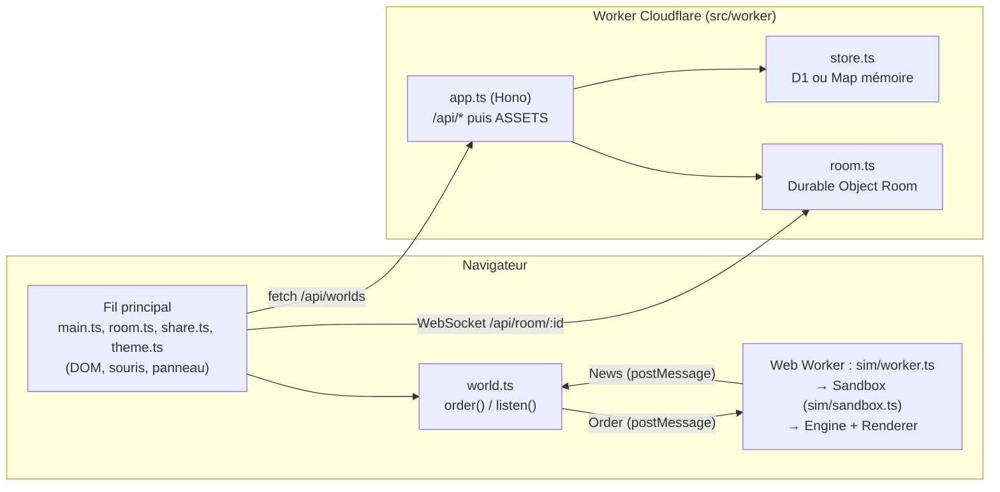

# Architecture

Vue d'ensemble pour un agent qui arrive sur le projet. Le détail des règles de
la simulation est dans [simulation.md](simulation.md).

## Trois fils d'exécution


```mermaid
flowchart LR
  subgraph Navigateur
    direction TB
    page["Fil principal<br/>main.ts, room.ts, share.ts, theme.ts<br/>(DOM, souris, panneau)"]
    world["world.ts<br/>order() / listen()"]
    sim["Web Worker : sim/worker.ts<br/>→ Sandbox (sim/sandbox.ts)<br/>→ Engine + Renderer"]
    page --> world
    world -- "Order (postMessage)" --> sim
    sim -- "News (postMessage)" --> world
  end
  subgraph Cloudflare["Worker Cloudflare (src/worker)"]
    app["app.ts (Hono)<br/>/api/* puis ASSETS"]
    store["store.ts<br/>D1 ou Map mémoire"]
    room["room.ts<br/>Durable Object Room"]
    app --> store
    app --> room
  end
  page -- "fetch /api/worlds" --> app
  page -- "WebSocket /api/room/:id" --> room
```

1. **Le fil principal** (page) ne simule rien. Il gère le DOM, traduit la souris
   en `Gesture`, envoie des **ordres** au bac et **colorie** la grille.
   Chaque frame n'apporte que les bandes changées (`patches`), en données
   brutes — matière, `life`, figé, température au degré, et le grain avec la
   première frame d'un moteur. world.ts les recopie **dès l'arrivée** dans un
   miroir de la grille (`blit()`), puis `present()` fait colorier le
   rectangle changé par [screen.ts](../../src/client/screen.ts) : un shader
   WebGL2 sur des textures entières, ou, sans WebGL2, `Renderer` puis un
   `putImageData`. Un envoi à l'écran par rafraîchissement. Ne jamais sauter
   une frame : elle ne porte que ce qui a changé, et le morceau resterait en
   retard pour de bon. La vue thermique ne regarde que la page : `order()`
   relève `heatmap` au passage et fait tout recolorier.
2. **Le Web Worker de simulation** ([sim/worker.ts](../../src/client/sim/worker.ts))
   héberge `Sandbox`, qui possède l'`Engine` et le `Tracker`. Quand la page
   est isolée (`crossOriginIsolated`, en-têtes COOP/COEP posés par app.ts et
   par vite.config.ts), il lance aussi des **fils auxiliaires** — lui-même,
   relancé par `import.meta.url` (le premier message dit le rôle : `start`
   pour le bac, une mémoire de moteur pour un auxiliaire ; un fichier à part
   embarquait une seconde copie du moteur), jusqu'à sept — que
   [sim/pool.ts](../../src/client/sim/pool.ts) fait travailler sur la
   mémoire partagée du moteur — voir « Plusieurs fils » dans
   [simulation.md](simulation.md). Sans isolation, le moteur tourne seul, au
   même résultat. Il avance au
   temps réellement écoulé (`setTimeout` à ~60 Hz, pas de `requestAnimationFrame`)
   et renvoie des **nouvelles**. L'échéance suivante est posée dans un
   `finally` : une exception du moteur ne coupe plus la boucle pour de bon.
   Une frame s'accorde au plus `SLICE` (12 ms) de simulation — bac, rejeu ou
   invité qui rattrape — et abandonne le reste de son retard : sinon une frame
   lente en réclame plus à la suivante, et en grande grille la boucle montait
   à huit ticks par frame. Un bac trop chargé ralentit, la page reste fluide.
3. **Le Worker Cloudflare** sert le site statique **et** l'API — il n'y a pas
   de projet Pages séparé.

Conséquence clé : **aucun module de la page n'importe l'`Engine`**. Tout ce
qui a besoin de la grille passe par [world.ts](../../src/client/world.ts).

## Le protocole page ↔ bac

Défini dans [sim/sandbox.ts](../../src/client/sim/sandbox.ts) (`Order`, `News`).

| Ordre (`order()`) | Effet côté bac |
| --- | --- |
| `do` `{g}` | Applique un `Gesture` (ignoré pendant un rejeu). **N'envoyer que via `gesture()` de main.ts.** |
| `set` `{k}` | Met à jour les réglages (`Knobs` : vent, ambiante, gravité, vitesse, pause, vue thermique, salon…) |
| `size` `{w,h,keep}` | Recrée moteur et rendu ; vide l'annulation, abandonne l'enregistrement, arrête le rejeu, désarme le défi |
| `load` `{data,ask?,quiet?}` | Pose une grille encodée ; `quiet` = sans cran d'annulation (salon). Arrête le rejeu et désarme le défi en cours — un monde-défi réarme le sien par `goal` juste après |
| `edit` | `clear` / `undo` / `redo` / `step` / `snapshot`. Pendant un rejeu, `step` l'avance d'un tick, `clear` / `undo` / `redo` l'arrêtent d'abord. `clear` désarme le défi |
| `scene` `{name}` | Bâtit un défi ou un décor de `challenges.ts` ; arrête le rejeu |
| `terrain` `{seed}` | Bâtit le monde de la graine (terrain.ts) à la taille du bac, graine ramenée dans 1..`SEEDS` ; même chemin que `scene` (rejeu arrêté, cran d'annulation, `stamp()`, défi désarmé). Refusé à un invité |
| `goal` `{goal}` | Objectif d'un monde-défi (`ge:12:600`) |
| `cursor` `{x,y}` | Position de la sonde |
| `clip` `{ask,…}` | Découpe un rectangle, répond par `reply` |
| `grid` `{ask}` | Répond par `reply` : la grille entière encodée à l'instant (`askGrid()` de world.ts) — ce que sauvegarde et lien doivent porter |
| `rec` / `play` `{on}` | Enregistrement / rejeu. Le rejeu obéit à la pause ; à sa fin, le moteur reprend les réglages du panneau (`knobs`) |
| `film` `{ask}` | Répond par `reply` : le dernier rejeu enregistré ou importé (`Recording`), ou `null` (`askFilm()` de world.ts) — ce qu'exportent lien et fichier |
| `reel` `{rec}` | Remplace le rejeu du bac par un rejeu importé, **déjà passé par `vet()`** côté page ; arrête le rejeu en cours. Refusé à un invité |

| Nouvelle (`listen()`) | Fréquence | Contenu |
| --- | --- | --- |
| `frame` | chaque frame | `patches` (bandes changées `{x,y,w,h,cells,life,frozen,temp,noise?}`, tampons **transférés** par sim/worker.ts ; liste vide au repos, grille entière et grain à la première frame d'un moteur), taille, `ambient` (le shader en a besoin), sonde `[matière, °C]`, `hero` `[x, y]` ou `null` (la caméra le suit) |
| `stats` | 2 × / s | nombre de cellules pleines |
| `grid` | si le bac a changé : toutes les 250 ms en 640×360, plus rarement au-delà (≈ 2 s en 1920×1080) | copie de secours de la grille (`full`, `latestGrid()`), pour ranger le bac quand l'onglet passe en arrière-plan — seul usage qui ne peut pas attendre une réponse |
| `reply` | à la demande | réponse numérotée à `askLoad()` / `askGrid()` / `askClip()` / `askFilm()` |
| `say` | à la demande | message pour la barre de statut |
| `won` | à la demande | le défi en cours est réussi (vérifié toutes les 500 ms dans le Worker) |
| `rec` / `play` | à la demande | fin d'enregistrement, début/fin de rejeu |

Questions-réponses : `askLoad()` et `askClip()` numérotent leur ordre (`ask`) et
attendent la `reply` qui porte le même numéro. C'est le seul moyen d'`await`
quelque chose du bac depuis la page.

`latestGrid()` rend la dernière nouvelle `grid` reçue : sauvegarder ou ranger
le bac en `localStorage` n'attend donc jamais le Worker (important quand
l'onglet part en arrière-plan).

## Le chemin d'un coup de pinceau

```
souris (main.ts)
  → gesture(g)                    ← passage unique, ne pas contourner
      ├─ order({t:"do", g})       → Sandbox.order → applyGesture(engine, g) → rec?.gesture(g)
      └─ relay(g)                 → WebSocket → hôte du salon (si on est invité)
```

Poster `order({t:"do"})` ailleurs que dans `gesture()` : le geste n'atteint pas
l'hôte d'un salon et un invité le voit effacé par l'instantané suivant.

Une créature de taille fixe (le lapin) passe par le même `paint`, mais
`placesCreature()` de main.ts n'en envoie qu'un par clic (ni trait ni dépôt
continu), et `paint()` côté moteur en pose une entière quel que soit le rayon
reçu : un pair de salon ne peut pas en semer un disque.

Les commandes du héros suivent le même chemin : `steer()` de main.ts envoie un
geste `{t:"pilot", keys}` (bits de `PILOT`) chaque fois que les touches tenues
changent — jamais à chaque image. Le rejeu l'enregistre, l'hôte d'un salon le
reçoit d'un invité ; `applyGesture` le borne à cinq bits. Quand la frame porte
un héros (`hero`), ZQSD / flèches / E le pilotent au lieu de déplacer la vue,
et `follow()` recentre la caméra sur lui à chaque image (un cinquième du
chemin, bornes comprises). À son apparition la vue zoome à ~160 cellules de
large (`meet()`). Glisser au clic du milieu (ou pincer) passe `loose` à vrai :
`follow()` ne tourne plus, la vue reste où on l'a mise ; un clic du milieu
sans bouger (moins de `CLICK` pixels) la raccroche, et `meet()` aussi.

## Salon partagé (bac multijoueur)

- Serveur : [src/worker/room.ts](../../src/worker/room.ts), un Durable Object par
  nom de salon, API d'hibernation des WebSockets. **Il relaie sans simuler**,
  mais pas à l'aveugle : [src/worker/relay.ts](../../src/worker/relay.ts)
  (pur, testé dans test/api.ts) lit le `type` de chaque message texte
  ≤ 200 000 caractères et ne laisse passer que `start` / `turn` de l'hôte
  vers les invités, `do` / `sync` d'un invité vers l'hôte. Un invité ne parle
  donc jamais aux autres invités, et `role` / `peers` ne viennent que du DO :
  un invité qui les imitait destituait l'hôte ou le faisait taire. Le rôle vit
  dans la pièce jointe du socket (`serializeAttachment`). 8 places.
- Client : [src/client/room.ts](../../src/client/room.ts) pour le réseau,
  `host()` / `follow()` / `catchUp()` de
  [sandbox.ts](../../src/client/sim/sandbox.ts) pour la simulation.
- **Lockstep** : chacun simule chez soi, le moteur étant déterministe
  (`engine.rand()`). Le premier connecté est **l'hôte** et mène la partie :
  les gestes des invités lui arrivent, il les applique au tick où il en est.
  Sa partie est un `Recorder` (replay.ts) vidé à chaque envoi (`drain()`) ;
  chaque invité la rejoue dans un `Player` qui s'allonge (`feed()`), un tiers
  de son retard par frame (32 ticks au plus). Si l'hôte part, le plus ancien
  restant est promu et repart de sa propre grille — la même, au retard près.
- Tout ce qui change la grille de l'hôte **sans geste** (vider, annuler,
  charger, décor, et le `Recorder` d'un enregistrement local, qui arrondit
  les températures) passe par `stamp()` de sandbox.ts, le salon en dernier :
  sinon les invités divergent. Un rejeu local est refusé tant qu'il y a du
  monde (il avancerait le bac hors de la partie).
- Un invité refuse tout ordre qui toucherait à son bac (`do`, `edit`, `scene`,
  `load`, `goal`, `rec`, `play`, `reel`) : ses gestes partent à l'hôte et lui
  reviennent dans la partie, après un aller-retour (pas de prédiction). Ses
  réglages restent dans le panneau et rentrent au moteur quand il part.
- Filet : une empreinte FNV de `cells` par seconde (`sums`). Un invité qui ne
  la retrouve pas envoie `sync` une fois ; l'hôte renvoie un départ, pas plus
  d'un toutes les 2 s (différé, pas jeté). Changer de taille chez un invité
  fait de même, et le départ reçu le remet à la taille de l'hôte.
- Un message qui dépasse le plafond du salon n'est pas envoyé (le DO le
  jetterait sans rien dire) : l'hôte le signale dans la barre de statut. Un
  départ pèse ~2 à 9 Ko, une suite ~50 octets.

| Message | Sens | Contenu |
| --- | --- | --- |
| `role` | DO → client | `{host: boolean}` |
| `peers` | DO → tous | `{n}` : nombre de connectés ; l'hôte renvoie un `start` quand il monte, se tait à 1 |
| `start` | hôte → invités | `{rec: Recording}` : grille complète (état vivant), `clock`, `seed`, `scan`, réglages |
| `turn` | hôte → invités | `{ticks, beats, sums}` toutes les 50 ms tant que le bac avance ou qu'il y a des gestes |
| `do` | invité → hôte | `{g: Gesture}` ; l'hôte l'applique via le même chemin que ses propres gestes |
| `sync` | invité → hôte | demande un nouveau `start` (empreinte différente, changement de taille) |

Ce qui arrive d'un pair n'est pas de confiance : `known()` écarte les ids de
matière inconnus, `disc()` borne les rayons, `applyGesture` refuse un `clip`
plus grand que le bac et toute coordonnée non entière (un `fill` en x = 1,5
gelait l'hôte). Le `life` d'un `clip` n'est pas filtré : voir « Données venues
d'ailleurs » dans [simulation.md](simulation.md).

## API HTTP

[src/worker/app.ts](../../src/worker/app.ts). **Aucun import de
`cloudflare:workers` dans ce fichier** : c'est ce qui permet à `test/api.ts` de
le charger dans Node. Ce qui en a besoin (le Durable Object) vit dans
`room.ts`, réexporté par `index.ts`.

| Route | Rôle | Garde-fous |
| --- | --- | --- |
| `GET /api/health` | état + backend (`d1` / `memory`) | — |
| `GET /api/worlds` | 50 mondes max, `data` **coupé au premier bloc** (matière seule, pour les vignettes) | — |
| `GET /api/worlds/:id` | monde complet, **incrémente `views`** | seul chemin de chargement depuis la galerie |
| `POST /api/worlds` | `{name, width, height, data, goal?}` → `201 {id, token}` | débit, `data` ≤ 200 000, dimensions entières et ≤ 1920×1080 cellules (`CELLS`, la plus grande grille du menu : en ajouter une plus grande = relever ce plafond), `goal` validé par regex |
| `DELETE /api/worlds/:id` | en-tête `x-world-token` requis | débit, `403` si mauvais jeton |
| `GET /api/room/:id` | upgrade WebSocket vers le DO | `503` sans binding `ROOM`, débit, `426` sans upgrade |
| `* /api/*` | `404` JSON | — |
| `GET *` | fichiers statiques (`ASSETS`) | `cache-control` immuable sous `/assets/`, `no-cache` sinon |

Un middleware pose sur **toute** réponse (sauf 101) une CSP stricte, `nosniff`
et `referrer-policy`. La CSP interdit script et style en ligne : ne pas mettre
d'attribut `style=` ni de `<script>` inline dans index.html, passer par le CSSOM.

Débit : binding `RL` (`unsafe` ratelimit dans wrangler.jsonc), 20 requêtes par
IP et par minute sur les écritures et l'ouverture de salon. Absent en local →
tout passe.

### Stockage

[src/worker/store.ts](../../src/worker/store.ts) : `createStore(env)` rend D1 si
`env.DB` existe, sinon une `Map` en mémoire (bouchon non partagé, vit dans
l'isolate). `test/api.ts` n'a pas de binding : c'est le bouchon. `npm run dev`
et `npm run preview`, eux, ont un D1 local (`/api/health` répond `d1`) : y
appliquer les migrations avec `--local`, sinon une route sur une table neuve
répond 500.

- Le `token` de suppression est tiré côté serveur, rendu **une seule fois** par
  le `POST`, et ne sort d'aucune lecture (`shown()` en mémoire, colonnes
  nommées dans les `SELECT` D1). Ne jamais écrire `SELECT *`.
- Le client garde ses jetons dans `localStorage` (`sandbox-rabbit:mondes`).
- Ménage nocturne (cron `0 4 * * *`, `scheduled` dans index.ts) : garde les
  50 plus récents. Les mondes à `token` NULL (d'avant la migration 0004) ne
  partent que par là.
- Schéma : un **nouveau** fichier numéroté dans [migrations/](../../migrations/),
  jamais de retouche d'un fichier existant. Appliquer avec
  `npx wrangler d1 migrations apply sandbox-rabbit --remote`.

## Format des grilles (codec)

[src/client/sim/codec.ts](../../src/client/sim/codec.ts) — RLE + base64 url,
jusqu'à quatre blocs séparés par `.` : `matière[.figé[.life.temp]]`.

- Même format pour la colonne `data` de D1, les liens `#320~…`, le salon,
  `localStorage` et les enregistrements. **Toute modification casse les mondes
  déjà sauvegardés** : ajouter un bloc en fin est compatible, changer
  l'encodage d'un bloc existant ne l'est pas.
- Un run de longueur 0 est une échappe vers un compte sur 16 bits.
- Température : un octet, pas de 8 °C depuis -60 °C.
- Un flux tronqué ne jette pas : `unrle` rend un tableau plus court, et
  l'appelant ne pose que ce qui est décrit.

## Côté page : qui fait quoi

| Module | Rôle | Testable sous Node ? |
| --- | --- | --- |
| [main.ts](../../src/client/main.ts) | palette, souris, zoom et caméra (bornes par `clampPan`, ZQSD / WASD / flèches tenues, `+` / `-`), réglages, défis, boucle rAF, câblage de tout le DOM | non |
| [world.ts](../../src/client/world.ts) | canvas, `WIDTH`/`HEIGHT` (liaisons vivantes réassignées par `resize()`), porte vers le Worker, miroir de la grille | non |
| [screen.ts](../../src/client/screen.ts) | colorie le miroir : shader WebGL2 (textures entières), secours 2D par `Renderer` | non |
| [ui.ts](../../src/client/ui.ts) | logique pure du panneau (objectifs, récents, zoom, cadence), accès `localStorage` tolérant | **oui** (test/ui.ts) |
| [gestures.ts](../../src/client/gestures.ts) | `Gesture` + `applyGesture(engine, g)` + météo | **oui** |
| [replay.ts](../../src/client/replay.ts) | `Recorder` / `Player` | **oui** |
| [challenges.ts](../../src/client/challenges.ts) | défis et décors bâtis en code | **oui** |
| [terrain.ts](../../src/client/terrain.ts) | monde généré par graine (relief, lacs, grottes, poches), bâti au repos ; tirage à lui, jamais `engine.rand()` | **oui** (test/sim.ts) |
| [room.ts](../../src/client/room.ts) | salon côté navigateur | non |
| [share.ts](../../src/client/share.ts) | galerie, PNG, vidéo, lien ; export / import du rejeu | non (le crible du rejeu, `vet()`, est dans replay.ts : **oui**) |
| [theme.ts](../../src/client/theme.ts) | jour / nuit | non |
| [sim/*](../../src/client/sim/) | moteur, rendu, codec, registre, bac | **oui** |

### Galerie et mondes-défis

Dans [share.ts](../../src/client/share.ts), pas dans main.ts. La galerie est un
`<dialog>` ouvert en `showModal()`, remplie par **une seule** requête
`GET /api/worlds` : les vignettes sont redessinées depuis la grille reçue
(`thumbnail()` de render.ts, sous-échantillonnée au-delà de 320 de large), et le
tri (récents / plus vus) se fait sur cette liste côté client. Cliquer une carte
recharge le monde par `GET /api/worlds/:id` — ne pas « optimiser » en
réutilisant la copie en main, c'est ce chemin qui compte les vues. Le `×` de
suppression n'apparaît que sur les cartes dont on détient le jeton. Un monde
qui porte un `goal` devient un `Challenge` par `challengeOf()`.

### Rejeu exporté

Aussi dans share.ts. « Lien du rejeu » et « Fichier du rejeu » demandent le
film au bac (`askFilm()`) : le fichier est le JSON du `Recording`
(`bac-….rejeu.json`), le lien le porte compressé — `pack()` de replay.ts,
deflate natif (`CompressionStream`) puis base64 url, derrière `#rejeu~` pour
ne pas le prendre pour un monde (`#320~…`). « Ouvrir un rejeu » lit un
fichier ; main.ts reconnaît `#rejeu~` à l'ouverture de la page. Dans les deux
cas, le texte passe par `parse()` / `unpack()`, qui finissent par `vet()` :
version, taille, types de chaque champ, grilles et morceaux collés
décodables, réglages de scène plausibles, beats dans l'ordre des ticks —
tout ce qui ferait lever le `Player` en plein tick. Plafond `FILM_MAX`
(8 Mo de JSON), vérifié **pendant** la décompression (lien) : quelques
kilo-octets de lien ne se déplient pas en gigaoctets. Le rejeu validé part au
bac par `watch()` (rappel passé à `initShare()`) : ordre `reel`, puis lecture
comme au bouton « Rejouer », taille du bac ajustée (`fit()`).

Les modules périphériques (`room`, `share`, `theme`) ne doivent **pas**
importer main.ts (cycle) : main.ts leur passe ce dont ils ont besoin par un
`init…()` à rappels.

Accès `localStorage` : uniquement via `read` / `write` / `forget` de ui.ts.
Un `localStorage.getItem` nu jette quand les cookies sont bloqués, et au
chargement d'un module cela laisse la page blanche. Clés existantes :
`sandbox-rabbit:mondes`, `:reglages`, `:records`, `:bac`, `:theme`.

`:bac` suit le format d'un lien de partage, `320~<grille>` (`loadWorld()` de
main.ts lit les deux ; une valeur sans `~`, d'avant, se charge dans le bac tel
qu'il est). Sans la largeur, un défi rangé en 320 depuis un bac réglé en 480
revenait cisaillé. Pour la même raison, `fit()` appelle `remember()` : une
taille imposée en code (défi, lien, galerie, salon) n'émet aucun événement.
