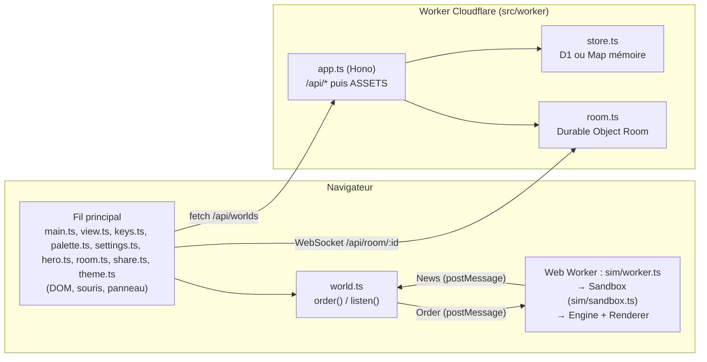

# Architecture

Vue d'ensemble pour un agent qui arrive sur le projet. Le détail des règles de
la simulation est dans [simulation.md](simulation.md).

## Trois fils d'exécution


```mermaid
flowchart LR
  subgraph Navigateur
    direction TB
    page["Fil principal<br/>main.ts, view.ts, keys.ts, palette.ts, settings.ts, hero.ts, room.ts, share.ts, theme.ts<br/>(DOM, souris, panneau)"]
    world["world.ts<br/>order() / listen()"]
    sim["Web Worker : sim/worker.ts<br/>→ Sandbox (sim/sandbox.ts)<br/>→ Engine + Renderer"]
    page --> world
    world -- "Order (postMessage)" --> sim
    sim -- "News (postMessage)" --> world
  end
  subgraph Cloudflare["Worker Cloudflare (src/worker)"]
    app["app.ts (Hono)<br/>/api/* puis ASSETS"]
    store["store.ts<br/>D1 ou Map mémoire"]
    room["room.ts<br/>Durable Object Room"]
    app --> store
    app --> room
  end
  page -- "fetch /api/worlds" --> app
  page -- "WebSocket /api/room/:id" --> room
```

1. **Le fil principal** (page) ne simule rien. Il gère le DOM, traduit la souris
   en `Gesture`, envoie des **ordres** au bac et **colorie** la grille.
   Chaque frame n'apporte que les bandes changées (`patches`), en données
   brutes — matière, `life`, figé, température et pression telles que le
   moteur les tient (flottants), et le grain avec la première frame d'un
   moteur —, toutes découpées dans **un seul tampon** par frame, transféré une
   fois. world.ts les recopie **dès l'arrivée** dans un miroir de la grille
   (`blit()` → `land()` de render.ts : rien que des copies, le miroir garde
   température et pression brutes, comme le moteur), puis **rend le tampon**
   au Worker (`{t: "spare", buffer}`, transféré, traité par worker.ts
   lui-même), qui le réutilise pour une frame suivante (`recycle()` /
   `claim()` de render.ts, trois tampons au plus). En 1920×1080 tout changé,
   arrondir côté Worker et y allouer un tableau par bande et par couche
   coûtait ~11 ms par frame au fil du bac, arrondir côté page ~15 ms ;
   préparation et pose tiennent maintenant en ~2 ms chacune
   (`npm run stress`). Puis `present()` fait colorier le
   rectangle changé par [screen.ts](../../src/client/screen.ts) : un shader
   WebGL2 sur des textures (entières, sauf température et pression, en flottants R32F, que le shader lit brutes comme `Renderer`), ou, sans WebGL2, `Renderer` puis un
   `putImageData`. Un envoi à l'écran par rafraîchissement. Ne jamais sauter
   une frame : elle ne porte que ce qui a changé, et le morceau resterait en
   retard pour de bon. La vue thermique ne regarde que la page : `order()`
   relève `heatmap` au passage et fait tout recolorier. La vue pression
   (case « Vue pression », `airView()` de world.ts) aussi, sans passer par
   le bac ; elle passe devant la thermique, et le panneau (settings.ts) ne
   laisse cocher que l'une des deux. L'éclairage global
   (case « Éclairage », `light()` de world.ts) est lui aussi un réglage de
   la page seule : en WebGL2, screen.ts recalcule la lumière de tout le bac à
   chaque frame arrivée (quelques passes à basse résolution, voir `SCENE`
   dans screen.ts) ; au repos, rien n'arrive et rien n'est recalculé. Sa
   finesse (Paramètres › Graphismes, `lightDetail()` de world.ts →
   `screen.detail()`) est la largeur maximale de la grille de lumière : 480,
   240 ou 120 texels.
   L'heure (menu « Heure », `hour()` de world.ts, teintes `HOURS` de
   render.ts) aussi : un `vec3 tint` du shader, tout recolorié quand elle
   change — une fois par seconde en mode « Cycle » (`setInterval` de settings.ts),
   qui avance aussi l'horloge `#clock` de la barre du haut (`CLOCK`, `clockAt()`).
2. **Le Web Worker de simulation** ([sim/worker.ts](../../src/client/sim/worker.ts))
   héberge `Sandbox`, qui possède l'`Engine` et le `Tracker`. Quand la page
   est isolée (`crossOriginIsolated`, en-têtes COOP/COEP posés par app.ts et
   par vite.config.ts), il lance aussi des **fils auxiliaires** — lui-même,
   relancé par `import.meta.url` (le premier message dit le rôle : `start`
   pour le bac, une mémoire de moteur pour un auxiliaire ; un fichier à part
   embarquait une seconde copie du moteur), jusqu'à quatorze — que
   [sim/pool.ts](../../src/client/sim/pool.ts) fait travailler sur la
   mémoire partagée du moteur — voir « Plusieurs fils » dans
   [simulation.md](simulation.md). Sans isolation, le moteur tourne seul, au
   même résultat. Il avance au
   temps réellement écoulé (`setTimeout`, pas de `requestAnimationFrame`)
   et renvoie des **nouvelles**. Sa cadence suit l'écran : la page mesure ses
   rafraîchissements (`beat()` de world.ts, médiane par `refreshPeriod()` de
   ui.ts) et envoie `{t: "pace", ms}`, traité par worker.ts lui-même (pas un
   `Order` du bac), borné entre 30 et 240 Hz. Le joueur peut la limiter à 60
   ou 30 images par seconde (Paramètres › Graphismes, `limitFps()` de
   world.ts, `framePeriod()` d'ui.ts) : réglage de la page seule, le salon
   n'en sait rien. La vitesse de la simulation
   n'en dépend pas (`ticksFor` compte en 60es de seconde) : un écran plus
   rapide montre plus d'images, pas plus de ticks. L'échéance suivante est posée dans un
   `finally` : une exception du moteur ne coupe plus la boucle pour de bon.
   Une frame s'accorde au plus `SLICE` (12 ms à 60 Hz, au prorata au-dessous :
   24 ms à 30 images par seconde, sinon un bac chargé ralentissait de moitié) de simulation — bac, rejeu ou
   invité qui rattrape — et abandonne le reste de son retard : sinon une frame
   lente en réclame plus à la suivante, et en grande grille la boucle montait
   à huit ticks par frame. Un bac trop chargé ralentit, la page reste fluide.
3. **Le Worker Cloudflare** sert le site statique **et** l'API — il n'y a pas
   de projet Pages séparé.

Le détail du coloriage de la page — textures, programmes WebGL2, éclairage
global — est dans [rendu.md](rendu.md).

Conséquence clé : **aucun module de la page n'importe l'`Engine`**. Tout ce
qui a besoin de la grille passe par [world.ts](../../src/client/world.ts).

## Le protocole page ↔ bac

Défini dans [sim/sandbox.ts](../../src/client/sim/sandbox.ts) (`Order`, `News`).

| Ordre (`order()`) | Effet côté bac |
| --- | --- |
| `do` `{g}` | Applique un `Gesture` (ignoré pendant un rejeu, écarté s'il ne passe pas `isGesture()` de replay.ts : celui d'un invité arrive brut). **N'envoyer que via `gesture()` de main.ts.** |
| `set` `{k}` | Met à jour les réglages (`Knobs` : vent, ambiante, gravité, vitesse, pause, vue thermique, salon…). Côté page, `set(k)` de world.ts l'envoie |
| `size` `{w,h,keep}` | Recrée moteur et rendu ; vide l'annulation, abandonne l'enregistrement, arrête le rejeu, désarme le défi |
| `load` `{data,ask?,quiet?}` | Pose une grille encodée ; `quiet` = sans cran d'annulation (salon). Arrête le rejeu et désarme le défi en cours — un monde-défi réarme le sien par `goal` juste après |
| `edit` | `clear` / `undo` / `redo` / `step` / `snapshot`. Pendant un rejeu, `step` l'avance d'un tick, `clear` / `undo` / `redo` l'arrêtent d'abord. `clear` désarme le défi |
| `scene` `{name}` | Bâtit un défi ou un décor de `challenges.ts` ; arrête le rejeu |
| `terrain` `{seed}` | Bâtit le monde de la graine (terrain.ts) à la taille du bac, graine ramenée dans 1..`SEEDS` ; même chemin que `scene` (rejeu arrêté, cran d'annulation, `stamp()`, défi désarmé). Refusé à un invité |
| `goal` `{goal}` | Objectif d'un monde-défi (`ge:12:600`) |
| `cursor` `{x,y}` | Position de la sonde |
| `clip` `{ask,…}` | Découpe un rectangle, répond par `reply` |
| `grid` `{ask}` | Répond par `reply` : la grille entière encodée à l'instant (`askGrid()` de world.ts) — ce que sauvegarde et lien doivent porter |
| `rec` / `play` `{on}` | Enregistrement / rejeu. Le rejeu obéit à la pause ; à sa fin, le moteur reprend les réglages du panneau (`knobs`) |
| `film` `{ask}` | Répond par `reply` : le dernier rejeu enregistré ou importé (`Recording`), ou `null` (`askFilm()` de world.ts) — ce qu'exportent lien et fichier |
| `reel` `{rec}` | Remplace le rejeu du bac par un rejeu importé, **déjà passé par `vet()`** côté page ; arrête le rejeu en cours. Refusé à un invité |
| `host` `{on}` | Devenir l'hôte d'un salon (`on` faux : cesser de diffuser). Arrête le rejeu, repart de la grille présente dans un `Recorder` neuf et répond par un `start` |
| `follow` `{rec}` | Suivre l'hôte : la partie reçue devient un `Player` après `vet()`. `null` = ne plus suivre, et les réglages du panneau rentrent au moteur |
| `turn` `{ticks,beats,sums}` | La suite de la partie de l'hôte, allongée dans le `Player` (`feed()`). Écartée si on ne suit personne, ou si `vetBeats()` la refuse |

| Nouvelle (`listen()`) | Fréquence | Contenu |
| --- | --- | --- |
| `frame` | chaque frame | `patches` (bandes changées `{x,y,w,h,cells,life,frozen,temp,press,noise?}`, `temp` et `press` en `Float32Array` bruts, toutes vues d'**un seul** tampon **transféré** par sim/worker.ts ; liste vide au repos, grille entière et grain à la première frame d'un moteur), taille, `ambient` (le shader en a besoin), sonde `[matière, °C]`, `hero` `[x, y, nom]` ou `null` (la caméra le suit ; le reste de sa fiche, la page le lit dans son miroir), `heard` : ce que la frame a fait d'audible (`Engine.heard` relevé puis remis à zéro : explosions, plus gros rayon et sa colonne, éclairs) ou `null` |
| `stats` | 2 × / s | nombre de cellules pleines ; `hum` : flammes (feu, braise), lave et niveau de météo, tout à zéro en pause — le fond sonore |
| `grid` | si le bac a changé : toutes les 250 ms en 640×360, plus rarement au-delà (≈ 2 s en 1920×1080) | copie de secours de la grille (`full`, `latestGrid()`), pour ranger le bac quand l'onglet passe en arrière-plan — seul usage qui ne peut pas attendre une réponse |
| `reply` | à la demande | réponse numérotée à `askLoad()` / `askGrid()` / `askClip()` / `askFilm()` |
| `say` | à la demande | message pour la barre de statut |
| `won` | à la demande | le défi en cours est réussi (vérifié toutes les 500 ms dans le Worker) |
| `rec` / `play` | à la demande | fin d'enregistrement, début/fin de rejeu |
| `start` | quand l'hôte (re)part | `{rec}` : sa grille entière et l'état de son tirage, à diffuser aux invités |
| `turn` | 20 × / s chez l'hôte, tant que le bac avance ou qu'il y a des gestes | `{ticks, beats, sums}` : jusqu'où il est allé, ce qui s'est passé, et une empreinte par seconde |
| `desync` | une fois par divergence | l'invité n'a pas retrouvé l'empreinte de l'hôte (ou son enregistrement local a changé de taille) : room.ts en fait un `sync` |

Questions-réponses : `askLoad()` et `askClip()` numérotent leur ordre (`ask`) et
attendent la `reply` qui porte le même numéro. C'est le seul moyen d'`await`
quelque chose du bac depuis la page.

`latestGrid()` rend la dernière nouvelle `grid` reçue : sauvegarder ou ranger
le bac en `localStorage` n'attend donc jamais le Worker (important quand
l'onglet part en arrière-plan).

## Le chemin d'un coup de pinceau

```
souris (main.ts)
  → gesture(g)                    ← passage unique, ne pas contourner
      ├─ order({t:"do", g})       → Sandbox.order → applyGesture(engine, g) → rec?.gesture(g)
      └─ relay(g)                 → WebSocket → hôte du salon (si on est invité)
```

Poster `order({t:"do"})` ailleurs que dans `gesture()` : le geste n'atteint pas
l'hôte d'un salon et un invité le voit effacé par l'instantané suivant.

Une créature de taille fixe (le lapin) passe par le même `paint`, mais
`placesCreature()` de main.ts n'en envoie qu'un par clic (ni trait ni dépôt
continu), et `paint()` côté moteur en pose une entière quel que soit le rayon
reçu : un pair de salon ne peut pas en semer un disque.

Les commandes du héros suivent le même chemin : `steer()` de main.ts envoie,
quand `pilot()` de hero.ts les voit changer, un
geste `{t:"pilot", keys}` (bits de `PILOT`, plus la matière choisie en bits
8-15 quand R est tenu) chaque fois que les touches tenues changent — jamais à
chaque image. Le rejeu l'enregistre, l'hôte d'un salon le reçoit d'un invité ;
`applyGesture` le borne à six bits et ne garde la matière que si `placeable()`
l'accepte. Passer au héros suivant (C, ou le bouton de l'encadré Héros) est
le geste `{t:"hero"}` : le moteur choisit lequel (`nextHero()`), et le
numéro du piloté voyage dans la `Scene` du rejeu (`chosen`). Renommer le héros suivi (encadré Héros) envoie de même le geste
`{t:"name", id, name}` : `id` est son numéro (`HERO_SLOTS.name`), un nom vide
rend celui d'origine. Changer de matière R tenu ne renvoie rien : la nouvelle part au
prochain changement de touches. Quand la frame porte un héros (`hero`), les
touches de direction, de creusage et de pose le pilotent au lieu de déplacer la vue,
et `follow()` (view.ts) recentre la caméra sur lui à chaque image (un cinquième du
chemin, bornes comprises). À son apparition la vue zoome à ~160 cellules de
large (`meet()` de hero.ts, appelé par `track()` à chaque frame). Glisser au clic du milieu (ou pincer) passe `loose` à vrai (`loosen()`) :
`follow()` ne tourne plus, la vue reste où on l'a mise ; un clic du milieu
sans bouger (moins de `CLICK` pixels) la raccroche (`tighten()`), et `meet()` aussi.

### Clavier réassignable

**Tous** les raccourcis clavier sont des actions (`ACTIONS` d'ui.ts),
réassignables dans l'onglet Raccourcis de la fenêtre Paramètres (`#settings`,
bouton ⚙ ; la touche `help`, `?` d'origine, l'ouvre sur cet onglet par
`openSettings()` de keys.ts). Il est rangé en encadrés
calqués sur les sections du panneau (`KEY_GROUPS` d'ui.ts : Matière,
Pinceau, Simulation, Physique du monde, Défis, Mondes, Héros et vue), chacun
avec ses gestes de souris, fixes ; un menu d'onglets (`#keys-menu`) en montre
un à la fois (`shownGroup`), `listBindings()` remplit le tout. Tous sont posés
dans la même case de grille, les autres en `visibility: hidden` : chacun a la
taille du plus grand, la fenêtre ne saute pas d'un onglet à l'autre. La
fenêtre Paramètres a elle-même une hauteur fixe (style.css) : les onglets Général,
Graphismes et Raccourcis ont la même taille, et un contenu trop long défile
(dans Raccourcis, seule la liste `#bindings` défile, menu et bouton restent). Chaque action
est dans un encadré et un seul (test/ui.ts). Les actions de Simulation et de
Mondes, et « recommencer le dernier défi » (`lastChallenge`), cliquent
simplement le bouton du panneau.
`combo()` écrit l'événement en combinaison (`Ctrl+z`, `Ctrl+Maj+z`, `g` :
Cmd vaut Ctrl, Maj ne compte qu'avec Ctrl ou Alt, puisque les chiffres AZERTY
la demandent), et `bound`, la table combinaison → action de `keymap()`, la
traduit. Les actions tenues (`MOVES` / `STEER`) vont dans `held`, rangées par
touche nue : relâchée avec ou sans Ctrl, elle se retrouve. Les flèches, A / W
et Ctrl+Maj+Z restent des alias tant qu'aucune action ne les prend. Une
touche prise par une autre action s'échange avec elle (`rebind()`) ; Tab,
Entrée, Échap et les modificateurs seuls (`RESERVED`) sont refusés. Un
écouteur en capture prend la touche attendue avant tout le reste.

V fait défiler trois vues (`VIEWS` de hero.ts) : de côté, de côté avec
l'encadré de ce que voit le héros, à la première personne. Les deux dernières
dessinent dans le canvas `#sight`, posé sur le bac : `gaze()` appelle, à
chaque image, `look()` de [sight.ts](../../src/client/sight.ts) sur le miroir
(`seen()` de world.ts) — 120 rayons en éventail de 120° depuis sa tête, du ciel
à ses pieds, arrêtés sur la première cellule non vide. Le héros vit dans un
plan : son œil ne reçoit qu'une ligne, une colonne d'un pixel de large que le
CSS étire (`data-view` = `inset` ou `eyes`). Son sens se lit dans le `life` de
son cœur (bit 7), déjà dans le miroir. Rien ne passe par le Worker, et le bac
de dessous continue d'être peint : un deuxième envoi à l'écran, de 120 pixels.

## Salon partagé (bac multijoueur)

- Serveur : [src/worker/room.ts](../../src/worker/room.ts), un Durable Object par
  nom de salon, API d'hibernation des WebSockets. **Il relaie sans simuler**,
  mais pas à l'aveugle : [src/worker/relay.ts](../../src/worker/relay.ts)
  (pur, testé dans test/api.ts) lit le `type` de chaque message texte
  ≤ 200 000 caractères et ne laisse passer que `start` / `turn` de l'hôte
  vers les invités, `do` / `sync` d'un invité vers l'hôte. Un invité ne parle
  donc jamais aux autres invités, et `role` / `peers` ne viennent que du DO :
  un invité qui les imitait destituait l'hôte ou le faisait taire. Le rôle vit
  dans la pièce jointe du socket (`serializeAttachment`). 8 places.
- Client : [src/client/room.ts](../../src/client/room.ts) pour le réseau,
  `host()` / `follow()` / `catchUp()` de
  [sandbox.ts](../../src/client/sim/sandbox.ts) pour la simulation.
- **Lockstep** : chacun simule chez soi, le moteur étant déterministe
  (`engine.rand()`). Le premier connecté est **l'hôte** et mène la partie :
  les gestes des invités lui arrivent, il les applique au tick où il en est.
  Sa partie est un `Recorder` (replay.ts) vidé à chaque envoi (`drain()`) ;
  chaque invité la rejoue dans un `Player` qui s'allonge (`feed()`), un tiers
  de son retard par frame (32 ticks au plus). Si l'hôte part, le plus ancien
  restant est promu et repart de sa propre grille — la même, au retard près.
- Tout ce qui change la grille de l'hôte **sans geste** (vider, annuler,
  charger, décor, et le `Recorder` d'un enregistrement local, qui arrondit
  les températures) passe par `stamp()` de sandbox.ts, le salon en dernier :
  sinon les invités divergent. Un rejeu local est refusé tant qu'il y a du
  monde (il avancerait le bac hors de la partie).
- Un invité refuse tout ordre qui toucherait à son bac (`do`, `edit`, `scene`,
  `load`, `goal`, `rec`, `play`, `reel`) : ses gestes partent à l'hôte et lui
  reviennent dans la partie, après un aller-retour (pas de prédiction). Ses
  réglages restent dans le panneau et rentrent au moteur quand il part.
- Filet : une empreinte FNV de `cells` par seconde (`sums`). Un invité qui ne
  la retrouve pas envoie `sync` une fois ; l'hôte renvoie un départ, pas plus
  d'un toutes les 2 s (différé, pas jeté). Changer de taille chez un invité
  fait de même, et le départ reçu le remet à la taille de l'hôte.
- Coupure : une connexion **établie** qui tombe sans que le joueur ait cliqué
  « Quitter » est retentée une fois après 1 s (`join()` de room.ts). Une
  tentative qui n'ouvre pas ne relance rien : pas de boucle contre un salon
  plein. On revient en invité si l'hôte a été promu entre-temps.
- Un message qui dépasse le plafond du salon n'est pas envoyé (le DO le
  jetterait sans rien dire) : l'hôte le signale dans la barre de statut. Un
  départ pèse ~2 à 9 Ko, une suite ~50 octets.

| Message | Sens | Contenu |
| --- | --- | --- |
| `role` | DO → client | `{host: boolean}` |
| `peers` | DO → tous | `{n}` : nombre de connectés ; l'hôte renvoie un `start` quand il monte, se tait à 1 |
| `start` | hôte → invités | `{rec: Recording}` : grille complète (état vivant), `clock`, `seed`, `scan`, réglages |
| `turn` | hôte → invités | `{ticks, beats, sums}` toutes les 50 ms tant que le bac avance ou qu'il y a des gestes |
| `do` | invité → hôte | `{g: Gesture}` ; l'hôte l'applique via le même chemin que ses propres gestes |
| `sync` | invité → hôte | demande un nouveau `start` (empreinte différente, changement de taille) |

### Le déroulé d'une partie

Qui parle quand, et avec quelles constantes (toutes dans sandbox.ts, sauf
`RESYNC` et le délai de reconnexion, dans room.ts côté page) :

1. **Entrée.** `join()` ouvre le WebSocket et le DO répond `role`. Hôte :
   `order({t:"follow", rec:null})` (on ne suit plus personne) puis `restart()`.
   Invité : on attend un `start`.
2. **`restart()`** envoie `order({t:"host", on: peers >= 2})` : **seul, l'hôte ne
   diffuse rien**. Il est rappelé à chaque `peers` qui monte (un arrivant ne
   connaît que l'état présent) et quand on retombe sous deux.
3. **`host(true)`** (sandbox.ts) arrête le rejeu, ouvre un `Recorder` sur la
   grille présente et répond par la nouvelle `start`, que room.ts relaie.
4. **La suite.** À chaque frame, `frame()` compte les millisecondes ; toutes les
   `TURN` = 50 ms, si le compteur de ticks a bougé ou qu'il y a des gestes, il
   envoie `turn` avec ce que le `Recorder` a accumulé (`drain()`, qui le vide) et
   les empreintes en attente. Un tick sur `SUM` = 60 (une seconde à vitesse
   normale) ajoute une empreinte FNV de `cells` à `sums`.
5. **Chez l'invité**, `catchUp()` avance d'**un tiers du retard** par frame,
   `CATCH_UP` = 32 ticks au plus : régulier quand les messages arrivent par
   paquets de trois frames, et l'écart se stabilise tout seul quelle que soit la
   vitesse de l'hôte. Avant chaque pas, si une empreinte est attendue à ce tick,
   il la compare — une seule fois : `lost` empêche d'inonder l'hôte de demandes.
   Un invité en retard reste en retard sans rien perdre, la partie l'attend.
6. **Divergence.** `desync` → room.ts envoie `sync` → l'hôte **diffère** la
   demande jusqu'à `RESYNC` = 2 s après son dernier départ, puis `restart()`.
   Différée et non jetée : sinon un invité qui divergerait sans cesse resterait
   figé. Une seule demande à la fois (`resync`).
7. **Taille.** Un `start` dont la taille n'est pas la nôtre déclenche le rappel
   `size()` (le sélecteur du panneau) et **la partie est ignorée** : le bac
   recréé, un nouveau `sync` ramènera un départ à la bonne taille.
8. **Départ de l'hôte.** Le DO promeut le plus ancien restant, qui reçoit `role`
   et repart de **sa** grille — la même, au retard près. Côté page, `leaveRoom()`
   rend la main au joueur (`onRole(true)`) : sans ça, un invité qui part restait
   en pause.
9. **Coupure.** Une connexion **établie** (`opened`) qui tombe sans « Quitter »
   (`quitting`) est retentée une fois après 1 s. Une tentative qui n'ouvre pas ne
   relance rien : pas de boucle contre un salon plein ou un Worker à terre. Le
   drapeau `failed` garde « Salon injoignable » d'être effacé par « Salon
   quitté », puisqu'un échec déclenche `error` **puis** `close`.

Ce que coûte une partie : un départ 2 à 9 Ko, une suite ~50 octets. Un message
au-delà de `HEAVY` = 200 000 caractères (le plafond du DO, `MAX` de relay.ts)
n'est pas envoyé — le DO le jetterait sans rien dire — et l'hôte le signale dans
la barre de statut.

Ce qui arrive d'un pair n'est pas de confiance : `known()` écarte les ids de
matière inconnus, `disc()` borne les rayons, `applyGesture` refuse un `clip`
plus grand que le bac et toute coordonnée non entière (un `fill` en x = 1,5
gelait l'hôte). Le `life` d'un `clip` n'est pas filtré : voir « Données venues
d'ailleurs » dans [simulation.md](simulation.md).

## API HTTP

[src/worker/app.ts](../../src/worker/app.ts). **Aucun import de
`cloudflare:workers` dans ce fichier** : c'est ce qui permet à `test/api.ts` de
le charger dans Node. Ce qui en a besoin (le Durable Object) vit dans
`room.ts`, réexporté par `index.ts`.

| Route | Rôle | Garde-fous |
| --- | --- | --- |
| `GET /api/health` | état + backend (`d1` / `memory`) | — |
| `GET /api/worlds` | les 50 plus récents **et** les 50 plus vus (`kept()` de store.ts, 100 max), `data` **coupé au premier bloc** (matière seule, pour les vignettes) | — |
| `GET /api/worlds/:id` | monde complet, **incrémente `views`** | seul chemin de chargement depuis la galerie ; au-delà du débit (compteur `vue:` à part), servi sans compter la vue |
| `POST /api/worlds` | `{name, width, height, data, goal?}` → `201 {id, token}` | débit, `data` ≤ 200 000, dimensions entières et ≤ 1920×1080 cellules (`CELLS`, la plus grande grille du menu : en ajouter une plus grande = relever ce plafond), `goal` validé par regex |
| `DELETE /api/worlds/:id` | en-tête `x-world-token` requis | débit, `403` si mauvais jeton |
| `GET /api/room/:id` | upgrade WebSocket vers le DO | `503` sans binding `ROOM`, débit, `426` sans upgrade |
| `POST /api/error` | rapport d'erreur d'un joueur (texte brut, par `sendBeacon`) → `console.error({message, report, agent})` → `204` ; rien en base | corps ≤ 16 Kio (`bodyLimit`, `413`), débit (compteur `erreur:` à part : une page qui boucle n'empêche pas de sauvegarder), `400` si vide |
| `* /api/*` | `404` JSON | — |
| `GET *` | fichiers statiques (`ASSETS`) | `cache-control` immuable sous `/assets/`, `no-cache` sinon |

Un middleware pose sur **toute** réponse (sauf 101) une CSP stricte, `nosniff`
et `referrer-policy`. La CSP interdit script et style en ligne : ne pas mettre
d'attribut `style=` ni de `<script>` inline dans index.html, passer par le CSSOM.

Débit : binding `RL` (`unsafe` ratelimit dans wrangler.jsonc), 20 requêtes par
IP et par minute sur les écritures et l'ouverture de salon. Absent en local →
tout passe.

### Erreurs des joueurs

[src/client/errors.ts](../../src/client/errors.ts) écoute `error` et
`unhandledrejection` sur la page, et `error` sur le Worker de simulation
(`watchErrors(sim)`, appelé par world.ts) : une exception du Worker n'atteint
jamais le `window` de la page. `reporter()` n'envoie chaque message qu'une fois,
cinq au plus par visite, coupé à 4 000 caractères. Rien d'autre ne part : ni
la grille ni rien qui désigne le joueur.

Les rapports se lisent dans les journaux du Worker, gardés par
`observability` (wrangler.jsonc) : tableau de bord Cloudflare → Workers →
sandbox-rabbit → Observability, filtre `message = "erreur joueur"`, ou en
direct avec `npx wrangler tail`. En `npm run dev`, ils s'affichent dans le
terminal. Les piles de production pointent dans le bundle minifié (voir le
`ponytail:` d'errors.ts).

### Stockage

[src/worker/store.ts](../../src/worker/store.ts) : `createStore(env)` rend D1 si
`env.DB` existe, sinon une `Map` en mémoire (bouchon non partagé, vit dans
l'isolate). `test/api.ts` n'a pas de binding : c'est le bouchon. `npm run dev`
et `npm run preview`, eux, ont un D1 local (`/api/health` répond `d1`) : y
appliquer les migrations avec `--local`, sinon une route sur une table neuve
répond 500.

- Le `token` de suppression est tiré côté serveur, rendu **une seule fois** par
  le `POST`, et ne sort d'aucune lecture (`shown()` en mémoire, colonnes
  nommées dans les `SELECT` D1). Ne jamais écrire `SELECT *`.
- Le client garde ses jetons dans `localStorage` (`sandbox-rabbit:mondes`).
- Ménage nocturne (cron `0 4 * * *`, `scheduled` dans index.ts) : garde les
  mondes que la galerie montre, les 50 plus récents et les 50 plus vus
  (`kept()` en mémoire, `KEPT` en SQL) : 50 sauvegardes de spam ne chassent
  plus un monde que les joueurs chargent. Les mondes à `token` NULL (d'avant la migration 0004) ne
  partent que par là.
- Schéma : un **nouveau** fichier numéroté dans [migrations/](../../migrations/),
  jamais de retouche d'un fichier existant. Appliquer avec
  `npx wrangler d1 migrations apply sandbox-rabbit --remote`.

## Format des grilles (codec)

[src/client/sim/codec.ts](../../src/client/sim/codec.ts) — RLE + base64 url,
jusqu'à cinq blocs séparés par `.` : `matière[.figé[.life.temp[.noms]]]`.
Le cinquième n'est pas une grille : les noms donnés aux héros
(`engine.names`), JSON `[[numéro, nom], …]` en base64 url, absent si personne
n'a été renommé. `decodeNames()` ne lève jamais (bloc illisible = pas de noms),
`cleanName()` borne un nom à `NAME_MAX` caractères.

- Même format pour la colonne `data` de D1, les liens `#320~…`, le salon,
  `localStorage` et les enregistrements. **Toute modification casse les mondes
  déjà sauvegardés** : ajouter un bloc en fin est compatible, changer
  l'encodage d'un bloc existant ne l'est pas.
- Un run de longueur 0 est une échappe vers un compte sur 16 bits.
- Température : un octet, pas de 8 °C depuis -60 °C.
- Un flux tronqué ne jette pas : `unrle` rend un tableau plus court, et
  l'appelant ne pose que ce qui est décrit.

## Côté page : qui fait quoi

| Module | Rôle | Testable sous Node ? |
| --- | --- | --- |
| [main.ts](../../src/client/main.ts) | souris, raccourcis, défis, rejeu, chargement du bac, boucle rAF, câblage de tout le DOM | non |
| [hero.ts](../../src/client/hero.ts) | le héros côté page : position (`hero`, relevée par `track()`), fiche de l'encadré Héros (`card()` : nom, santé, âge, température, compteurs lus dans le miroir ; `nameInput`, `heroId`), cadre `#halo` autour du héros piloté dans les vues de côté (`mark()`, repère posé sur la scène, pas dans le rendu), caméra décrochée (`loose`), commandes tenues (`pilot()`, `STEER`), vues et encadré `#sight` (`nextView()`, `gaze()`) | non |
| [palette.ts](../../src/client/palette.ts) | palette des matières et six récentes ; `select()`, qui tient `current` et `emit` (matière des sources) | non |
| [settings.ts](../../src/client/settings.ts) | contrôles du panneau (pinceau, outil, vitesse, vent, ambiante, taille, météo, heure, éclairage), ceux des onglets Graphismes (limite d'images par seconde, échelle entière, finesse de l'éclairage) et Son (case, volume) de la fenêtre Paramètres, et le blob `:reglages` ; `fit()` impose une taille, `restore()` rejoue les réglages retenus. main.ts appelle `restore()` une fois ses écouteurs posés, **avant** de charger le bac gardé : la taille restaurée l'effacerait | non |
| [view.ts](../../src/client/view.ts) | zoom et caméra : `zoomAt` (borné de 1 à 12), `zoomCentered`, `panBy`, `follow`, `scroll` (ZQSD / WASD / flèches tenues, `MOVES`), molette ; bornes par `clampPan`. Échelle entière (`wholePixels()`, Paramètres › Graphismes) : `fitCanvas()` pose largeur **et** hauteur du canvas au plus grand multiple entier, en pixels physiques, qui tient dans la scène (`wholeScale` d'ui.ts) — ou étire si l'arrondi coûte plus d'un quart de la taille ; refait à chaque changement de taille de la scène (`ResizeObserver`, différé d'une image : sur téléphone la scène suit la hauteur du bac) et de la grille | non |
| [keys.ts](../../src/client/keys.ts) | touches réassignables (`bindings`, `bound`), touches tenues (`held`), fenêtre Paramètres (`openSettings()`, onglet Raccourcis) | non |
| [world.ts](../../src/client/world.ts) | canvas, `WIDTH`/`HEIGHT` (liaisons vivantes réassignées par `resize()`), porte vers le Worker, miroir de la grille (lu par `seen()`), `cellBox()` : où sont les cellules à l'écran, bordure du canvas exclue (le zoom la grossit) — tout passage cellule ↔ pixel (clic, sélection, cadre du héros) passe par lui | non |
| [audio.ts](../../src/client/audio.ts) | porte du son : retient case, volume et fond sonore, et ne charge sound.ts (`import()`) qu'au premier geste du joueur — le navigateur refuse de jouer avant, et la page a son budget (84 Kio). `initSound()` (main.ts), `hear()` à chaque frame, `setHum()` à chaque `stats` | non |
| [sound.ts](../../src/client/sound.ts) | le son, synthétisé par Web Audio (aucun fichier) : explosion (bruit blanc sous un passe-bas qui se referme, plus long et plus grave avec le rayon), éclair puis tonnerre, boucles de feu (claquements), de lave (bruit brun) et de pluie ; stéréo selon la colonne ; six voix au plus ; se tait onglet caché. Tirage en `Math.random()` : il ne touche que l'oreille | `humLevel()`, `rainLevel()`, `boomShape()`, `panOf()` : **oui** (test/ui.ts) |
| [errors.ts](../../src/client/errors.ts) | remonte les exceptions de la page et du Worker de simulation vers `POST /api/error` (voir « Erreurs des joueurs ») | `reporter()` : **oui** (test/ui.ts) |
| [screen.ts](../../src/client/screen.ts) | colorie le miroir : shader WebGL2 (textures entières) et éclairage global par *radiance cascades*, remonté après une perte de contexte ; secours 2D par `Renderer` (sans éclairage) | non |
| [ui.ts](../../src/client/ui.ts) | logique pure du panneau (objectifs, récents, zoom, cadence, touches réassignables), accès `localStorage` tolérant | **oui** (test/ui.ts) |
| [sight.ts](../../src/client/sight.ts) | ce que voit le héros : `look()` lance un éventail de rayons dans une grille et rend une colonne de pixels | **oui** (test/ui.ts) |
| [gestures.ts](../../src/client/gestures.ts) | `Gesture` + `applyGesture(engine, g)` + météo (`weather(engine, niveau)` : 0 sec, 1 pluie, 2 orage, 3 gros orage, éclairs compris ; le niveau est le réglage `weather` et le champ `weather` d'une `Scene`, booléen dans les enregistrements d'avant l'orage) | **oui** |
| [replay.ts](../../src/client/replay.ts) | `Recorder` / `Player` | **oui** |
| [challenges.ts](../../src/client/challenges.ts) | défis et décors bâtis en code | **oui** |
| [terrain.ts](../../src/client/terrain.ts) | monde généré par graine (relief, lacs, grottes, poches), bâti au repos ; tirage à lui, jamais `engine.rand()` | **oui** (test/sim.ts) |
| [room.ts](../../src/client/room.ts) | salon côté navigateur | non |
| [share.ts](../../src/client/share.ts) | galerie, PNG, vidéo, lien ; export / import du rejeu | non (le crible du rejeu, `vet()`, est dans replay.ts : **oui**) |
| [theme.ts](../../src/client/theme.ts) | thème Système / Jour / Nuit, onglet Général de la fenêtre Paramètres (onglets câblés dans keys.ts) | non |
| [sim/*](../../src/client/sim/) | moteur, rendu, codec, registre, bac | **oui** |

### Galerie et mondes-défis

Dans [share.ts](../../src/client/share.ts), pas dans main.ts. La galerie est un
`<dialog>` ouvert en `showModal()`, remplie par **une seule** requête
`GET /api/worlds` : les vignettes sont redessinées depuis la grille reçue
(`thumbnail()` de render.ts, sous-échantillonnée au-delà de 320 de large), et le
tri (récents / plus vus) se fait sur cette liste côté client. Cliquer une carte
recharge le monde par `GET /api/worlds/:id` — ne pas « optimiser » en
réutilisant la copie en main, c'est ce chemin qui compte les vues. Le `×` de
suppression n'apparaît que sur les cartes dont on détient le jeton. Un monde
qui porte un `goal` devient un `Challenge` par `challengeOf()`.

### Rejeu exporté

Aussi dans share.ts. « Lien du rejeu » et « Fichier du rejeu » demandent le
film au bac (`askFilm()`) : le fichier est le JSON du `Recording`
(`bac-….rejeu.json`), le lien le porte compressé — `pack()` de replay.ts,
deflate natif (`CompressionStream`) puis base64 url, derrière `#rejeu~` pour
ne pas le prendre pour un monde (`#320~…`). « Ouvrir un rejeu » lit un
fichier ; main.ts reconnaît `#rejeu~` à l'ouverture de la page. Dans les deux
cas, le texte passe par `parse()` / `unpack()`, qui finissent par `vet()` :
version, taille, types de chaque champ, grilles et morceaux collés
décodables, réglages de scène plausibles, beats dans l'ordre des ticks —
tout ce qui ferait lever le `Player` en plein tick. Plafond `FILM_MAX`
(8 Mo de JSON), vérifié **pendant** la décompression (lien) : quelques
kilo-octets de lien ne se déplient pas en gigaoctets. Le rejeu validé part au
bac par `watch()` (rappel passé à `initShare()`) : ordre `reel`, puis lecture
comme au bouton « Rejouer », taille du bac ajustée (`fit()`).

Les modules périphériques (`room`, `share`, `theme`, `view`, `keys`, `palette`, `settings`, `hero`) ne doivent **pas**
importer main.ts (cycle) : main.ts leur passe ce dont ils ont besoin par un
`init…()` à rappels.

Accès `localStorage` : uniquement via `read` / `write` / `forget` de ui.ts
(`stored()` y lit un JSON en tolérant qu'il soit abîmé).
Un `localStorage.getItem` nu jette quand les cookies sont bloqués, et au
chargement d'un module cela laisse la page blanche. Clés existantes :
`sandbox-rabbit:mondes`, `:reglages`, `:records`, `:bac`, `:theme`, `:touches`
(les touches réassignées, relues par `parseBindings()`).

`:bac` suit le format d'un lien de partage, `320~<grille>` (`loadWorld()` de
main.ts lit les deux ; une valeur sans `~`, d'avant, se charge dans le bac tel
qu'il est). Sans la largeur, un défi rangé en 320 depuis un bac réglé en 480
revenait cisaillé. Pour la même raison, `fit()` de settings.ts appelle `remember()` : une
taille imposée en code (défi, lien, galerie, salon) n'émet aucun événement.
